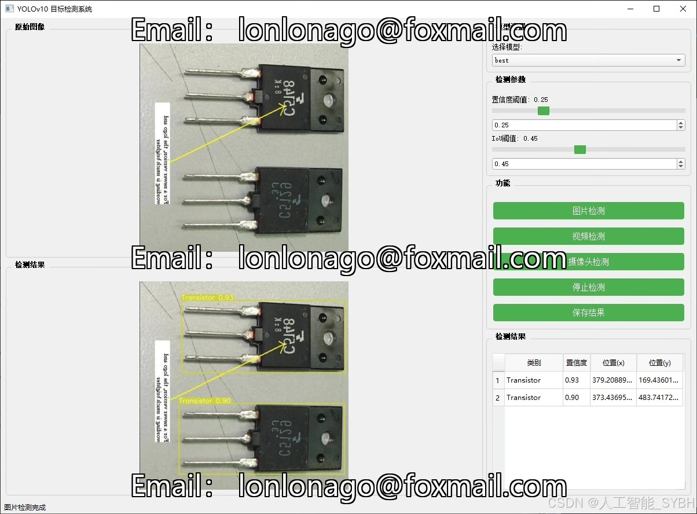
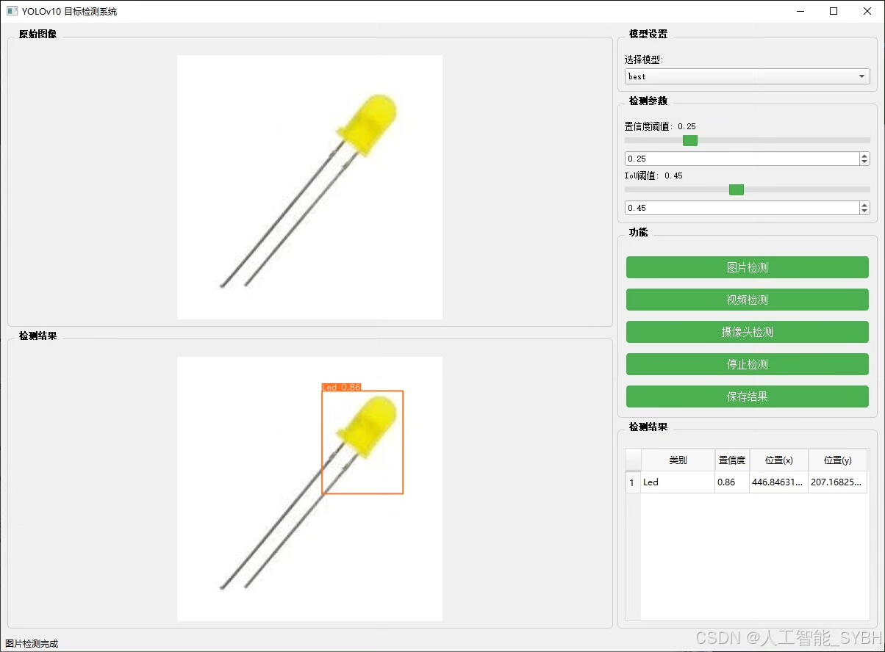
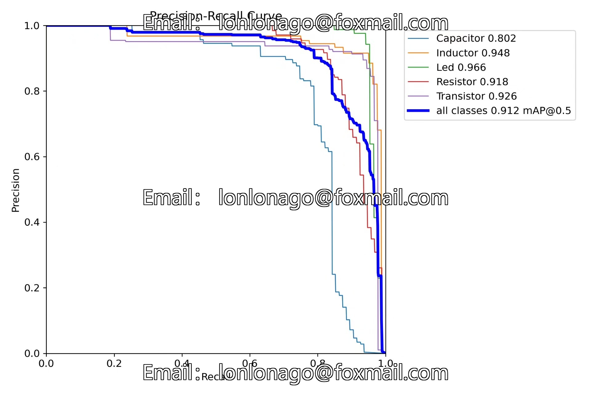
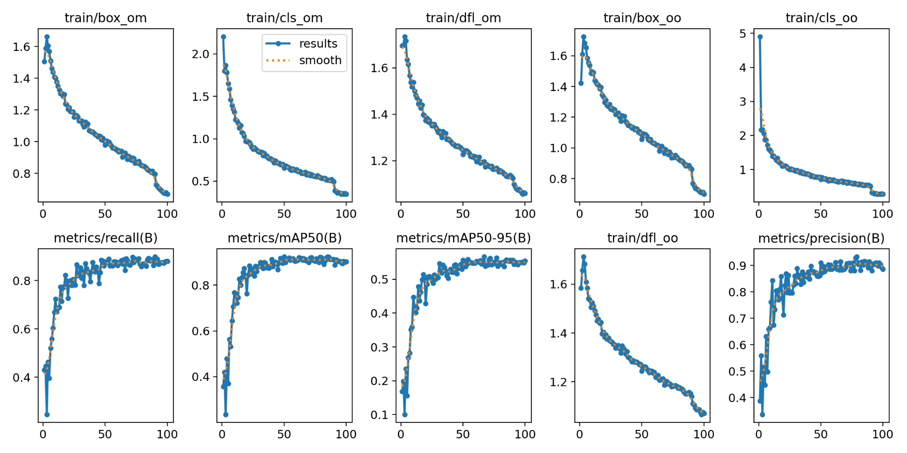
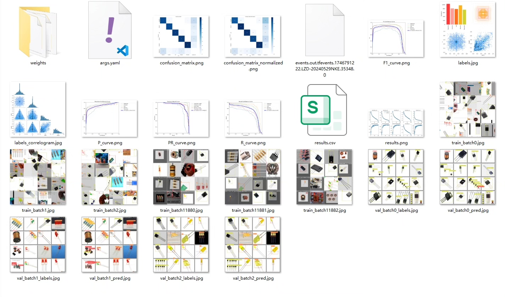
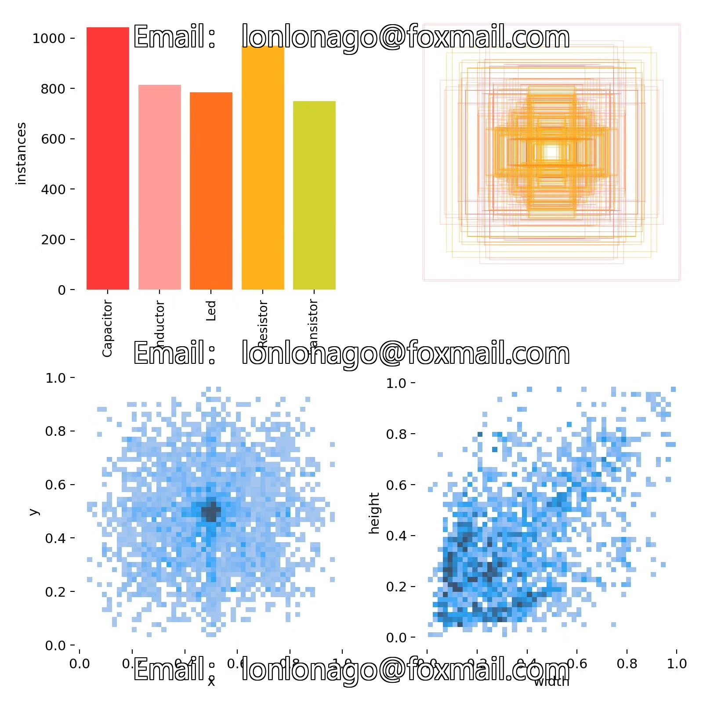
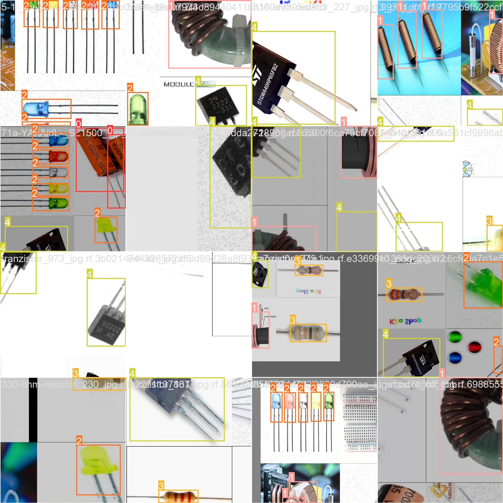
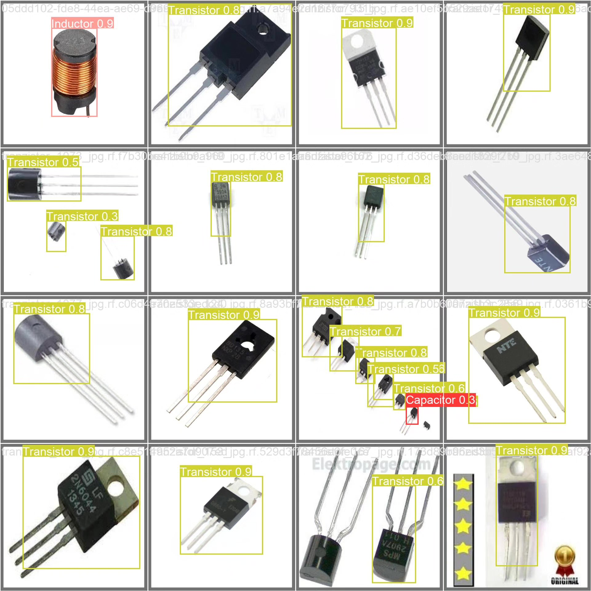

# YOLOv10-based electronic component target detection system based on deep learning

## Body

This project is based on the YOLOv10 deep learning framework, developing a high-precision automatic recognition and classification system for electronic components. The system can accurately detect and distinguish five common electronic components: 'Capacitor', 'Inductor', 'Led', 'Resistor', and 'Transistor'. The project uses a professional dataset containing 2426 high-quality images for model training and validation, with 2103 training images, 226 validation images, and 97 test images. This system can be widely applied in scenarios such as electronic manufacturing, circuit board inspection, component sorting, etc., providing key technical support for the intelligent upgrade of the electronic industry.

The company's products have obtained the official commercial license certification from YOLO.

We provide after-sales service.

After payment, we will provide WeChat ID to answer questions anytime.

Environment configuration: We will provide an environment configuration tutorial, and WeChat will provide答疑.

Remote installation service: If you need remote configuration, an additional fee of 69 is required.
If the configuration fails, all fees will be refunded (specially for old computers only refund installation fees).

Retraining dataset: After configuring the environment, you can train on your own computer.
If you need us to retrain, just pay 69 + computing power fees (2.5 yuan/hour)

## Images

## Payment

Here is a pay link on Stripe ( https://buy.stripe.com/3cs8yP7sY87d0vu9AB ). Please contact me lonlonago@foxmail.com after funding $89, and I will send you a complete data files , thank you!

